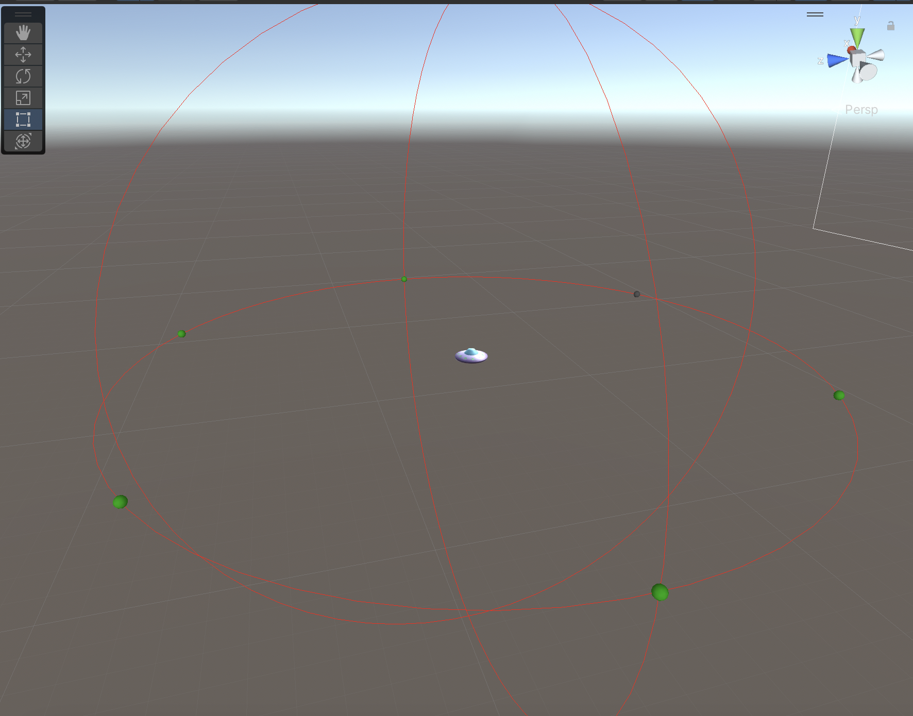

# Intergalactic-Rescue
Mobile top-down endless chaser I worked on for Vigilance Mobile. This project was in development for a year due to development and design issues. Starting with a team of 10 and finishing with only me working on it, I reworked the game design into a super simple game loop - save the cows and try not to get hit by the hunters. 

# What I contributed to the project
- Player Controller
- Mobile Input System
- AI 
- Spawn Placement system
- Power System/handler (deprecated)
- Enemy Manager

I've also worked all over this project fixing problems with refactoring code to make it more optimized for mobile.

## Animal Spawning Technique
To create this dynamic spawning system, I created a modifiable gride that on each point it checks if it's clear to place an object - which you can change the size/radius of the point and the spacing between each of them. If the area is clear, that point location data is stored for it to be used for placement. 

(Debug Mode)Red - Unable to spawn || Green - Can spawn

When randomly placing the item, it will select a random element from the stored (available) point data and place the item. Then to make sure that the items don't spawn so close to each other, it will make sure any other available location around that point is unable to spawn around it. 

## Enemy Spawning Technique
For enemy spawning, I wanted to keep it simple. The enemy spawns around the player from a randomly selected point on a radius around the player. 

The points on the circumference and modified easily for quick tweaking

Then to make sure that enemies don't spawn in objects, it checks if that point is overlapping. If it is, it will remove itself from available spawn points for the enemy to spawn from.

(Debug Mode)Grey - Unable to spawn || Green - Can spawn

### Enemy Movement

The AI works 

